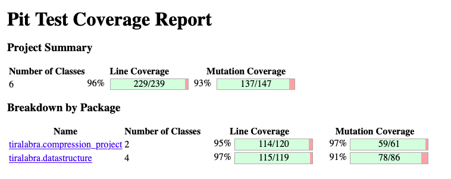

## Testausdokumentti

### Ohjelman testaus

Ohjelmaa on testattu yksikkötesteillä. Yksikkötestit testaavat ohjelmassa toteutettuja luokkia ja niiden toimivuutta. Yksikkötesteissä on pyritty mahdollisimman tarkasti testaamaan erilaisia tapauksia, jotta nähdään, toimiiko ohjelma oikein ja tarpeeksi nopeasti. Alla olevassa kuvassa näkyvät rivikattavuus ja mutaatiotestien kattavuus. Kattavuus on automaattisten raporttien perusteella varsin hyvä.

- Kuinka kauan suorittaa:
- Onnistuuko tekemään:
- Mitä ei testata:
  - Pohjoismaisia merkkejä on testattu yhdellä yksikkötestillä (joka toimii). Oletettavaa kuitenkin on, että monet erikoismerkit, mukaan lukien ääkköset, saattavat hajottaa ohjelman, erityisesti Huffmanin algoritmin, joka perustuu merkkien ASCII-koodauksessa vastaavaan kokonaislukuun.

  - Erilaisia tiedostotyyppejä ei ole testattu tai otettu huomioon. Ohjelmaa on testattu merkkijonoilla ja tekstitiedostoilla.

  - Tiedoston avaamista ja sen toimintaa ei testata, koska voidaan olettaa, että Javan omat funktiot toimivat oikein.

### Testitapaukset
Testauksessa on otettu huomioon erityisesti alla olevia testitapauksia.

ELI MUKAAN SIIS
- TIEDOSTON KOKO
- KULUNUT AIKA
- MILLAINEN TESTATTAVA TIEDOSTO ON

#### Huffman
- Saman kirjaimen/ilmauksen toisto

- Täysin satunnainen / Raamattu

- Raamattu

#### LZW
- Saman kirjaimen/ilmauksen toisto
Nähdään, että tässä algoritmi toimii parhaiten, erityisesti mahdollisimman pitkillä syötteillä.

- Täysin satunnainen / Raamattu
LZW tuottaa lähes saman kuin Huffman. Pituus vaikuttaa kuitenkin asiaan: jos syöte on lyhyt, kompressio on jopa isompi kuin alkuperäinen tiedosto. Raamatun kohdalla toistoa on tapahtunut (jos otetaan huomioon myös Raamatun muutenkin jossain määrin toisteinen kieli), ja täten myös kompressio on hyvin onnistunut.

### Tilastoja testauksesta
